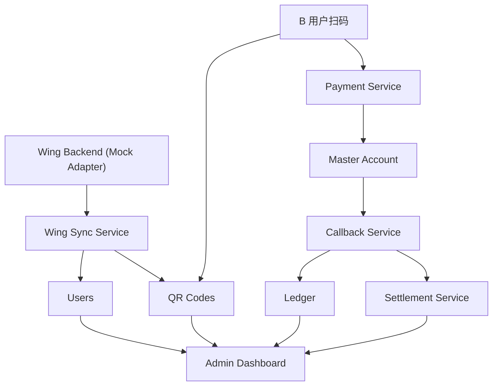

# WING BANK + BAKONG 客户专属二维码系统

Feature Name: wing-bakong-customer-qr-system
Updated: 2026-08-13

## Description

在现有 BAKONG + Wing 中转结算系统基础上，实现 Wing 客户自动同步与客户专属二维码。系统从已绑定的 Wing 后台（V1.0 为 mock 适配层）读取客户资料（Customer ID、实名、KYC、USD/KHR 账户），自动创建客户并为每位客户生成 USD 与 KHR 专属收款二维码。其他用户扫码后经正式支付流程（V1.0 为 mock provider）付款，支付成功通过 Callback 验证、记账、去重并完成结算。

## Architecture

## Components and Interfaces

### 1. Wing Sync Adapter（新增）

- **WingProvider 接口**：`getCustomerDetail(customerId)`、`listNewCustomers(since)`。
- **MockWingProvider**：内置示例客户数据集，模拟 Wing 后台返回 Customer ID、Real Name、KYC Status、Phone、Wing USD/KHR Account、Registration Time、Account Status。
- **接口职责**：为同步服务提供统一的 Wing 数据源抽象，后续可替换为真实 Wing API 实现。

### 2. Wing Sync Service（新增）

- 触发同步：系统启动时执行一次全量同步；后台提供"立即同步"入口。
- 流程：读取新客户 → 校验必填字段 → 若 customer_id 不存在则创建 User → 生成 USD/KHR 双 QR → 记录同步日志。
- 失败处理：同步失败写入 exception_queue（category=WING_SYNC），支持重试。

### 3. User Service（扩展）

- 新增字段：customer_id、kyc_status、wing_usd_account、wing_khr_account、registration_at。
- 新增操作：冻结/解冻（status 切换）、客户详情聚合查询（基本信息 + 双 QR + 交易 + 账本 + 结算）。

### 4. QR Service（扩展）

- 为每个客户生成两条二维码：qr_type=PERSONAL + currency=USD/KHR。
- 新增可读 QR Code 编号：`QR-{customerId}`、`QR-USD-{customerId}`、`QR-KHR-{customerId}`。
- 操作：查看、下载、启用、停用、重新生成（生成新 Payload）。
- QR 状态扩展为 ACTIVE / DISABLED / INVALID / EXPIRED。
- 生成必须复用现有 KHQR 标准生成器（Tag 29 个人收款码），二维码展示姓名与收款账户实名一致。

### 5. Payment Service（沿用 + 适配）

- 扫码付款按二维码币种与收款账户创建 Payment Order，收款账户来自 C 用户的 wing_usd_account / wing_khr_account。
- 支付页面展示收款人实名与币种金额（USD / KHR）。
- Provider 保持 mock：模拟支付成功并触发回调。

### 6. Callback Service（沿用）

- 校验 Transaction ID、Amount、Currency、Receiver、Order ID、Timestamp、Signature。
- Transaction ID 幂等：transaction_id UNIQUE，重复 Callback 拒绝重复入账。
- 验证成功 → 订单 SUCCESS + Ledger 记账（Master +金额，C 用户应收 +金额）；失败 → FAILED/ERROR 入异常队列。

### 7. Ledger（扩展）

- ledger_entries 新增 currency 字段。
- 记账在数据库事务内完成：Master +金额、C 用户 Receivable +金额（status=PENDING_SETTLEMENT）。

### 8. Settlement Service（沿用 + 扩展）

- settlement_records 新增 currency 字段。
- 结算目的地为 C 用户对应币种 Wing 账户（wing_usd_account / wing_khr_account）。
- 结算状态沿用现有枚举：PAYMENT_PENDING、PAYMENT_SUCCESS、MASTER_RECEIVED、SETTLEMENT_PENDING、SETTLEMENT_PROCESSING、SETTLEMENT_SUCCESS、SETTLEMENT_FAILED。
- 失败允许重新处理（异常队列 + 重试入口）。

### 9. Admin Dashboard（扩展）

- 首页新增/核对指标：客户总数、今日新增客户、USD/KHR QR 数量、今日支付笔数/金额、待结算/已结算金额、失败交易、异常 Callback。
- 客户列表与详情页：展示 USD/KHR 双 QR，支持查看、下载、停用、重新生成。
- QR 管理页：全量二维码列表与状态操作。

## Data Models

### 表结构演进（基于现有 schema 增量迁移）

**users**（新增列）

| 列 | 类型 | 说明 |
|---|---|---|
| customer_id | varchar UNIQUE | Wing Customer ID（如 100001） |
| kyc_status | varchar | VERIFIED / PENDING / FAILED |
| wing_usd_account | varchar | Wing USD 账户 |
| wing_khr_account | varchar | Wing KHR 账户 |
| registration_at | timestamptz | Wing 注册时间 |

（保留现有 id、wing_account、real_name、phone、status、created_at、updated_at）

**qr_codes**（新增列）

| 列 | 类型 | 说明 |
|---|---|---|
| code | varchar UNIQUE | 可读编号 QR-USD-100001 / QR-KHR-100001 |
| currency | varchar(3) | USD / KHR |

（保留现有 user_id、qr_type、qr_payload、qr_image、status、created_at、updated_at；QrStatus 扩展为 ACTIVE/DISABLED/INVALID/EXPIRED）

**ledger_entries**（新增列）

| 列 | 类型 | 说明 |
|---|---|---|
| currency | varchar(3) | USD / KHR |

**settlement_records**（新增列）

| 列 | 类型 | 说明 |
|---|---|---|
| currency | varchar(3) | USD / KHR |

**新表 wing_sync_logs**

| 列 | 类型 | 说明 |
|---|---|---|
| id | uuid PK | |
| customer_id | varchar | Wing Customer ID |
| action | varchar | CREATED / UPDATED / FAILED |
| payload | jsonb | 同步的客户资料快照 |
| status | varchar | SUCCESS / FAILED |
| created_at | timestamptz | |

其余现有表（payment_orders、callbacks、master_accounts、audit_logs、exception_queue）结构满足需求，保持不变。

## Correctness Properties

- 同一 Wing Customer ID 在 users 表唯一，防止重复建档。
- 同一客户同一币种至多存在一条 ACTIVE 二维码；重新生成时旧二维码置为 INVALID。
- transaction_id 在 payment_orders 与 callbacks 均唯一，保证幂等。
- 记账（Master +金额 / C 用户应收 +金额）在单一数据库事务内完成，全部成功或全部回滚。
- 二维码 Payload 必须由正式 KHQR 标准生成器产出，且展示姓名与收款账户实名一致。
- 结算状态机迁移合法：NONE → SETTLEMENT_PENDING → SETTLEMENT_PROCESSING → SETTLEMENT_SUCCESS / SETTLEMENT_FAILED（失败可回退重试）。

## Error Handling

| 场景 | 处理 |
|---|---|
| Wing 接口不可用 | 同步失败入 exception_queue（category=WING_SYNC），支持重试 |
| 客户必填字段缺失 | 跳过建档，写入 wing_sync_logs(status=FAILED) 并告警 |
| Callback 签名/字段校验失败 | 订单置 FAILED/ERROR，记录回调 payload 入异常队列 |
| 重复 Transaction ID | 拒绝重复入账，记录去重日志 |
| 结算失败 | settlement status=SETTLEMENT_FAILED，允许重新处理 |
| 数据库约束冲突 | 事务回滚，错误写入 Error Log |

## Test Strategy

- **单元测试**：WingProvider 适配层（mock 数据解析）、QR 生成（Paylaod 标准校验 + 姓名一致性）、状态机迁移合法性、幂等判断。
- **集成测试**：mock 支付 → 回调 → 记账 → 结算全链路（B 用户扫码付款给 C 用户）。
- **回归测试**：现有 API（users、payments、settlements、auth、admin）不因 schema 演进破坏。
- **验收测试**：按 requirements.md 的 Acceptance Criteria 逐条执行。

## References

[^1]: (File) - [现有需求与决策](requirements.md)
[^2]: (Code) - [现有数据库迁移 schema](/workspace/backend/dist/migrations/1786623580893-InitSchema.js)
[^3]: (Code) - [KHQR 生成与校验实现（dist/qr）](/workspace/backend/dist/qr/qr.service.js)
